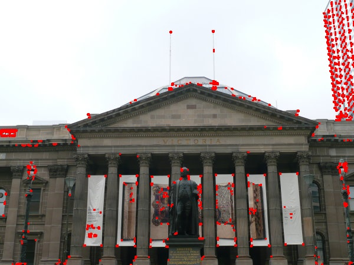
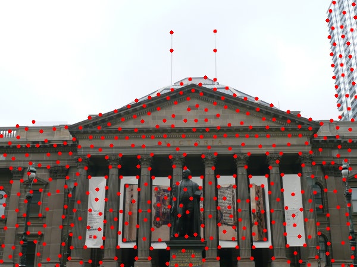
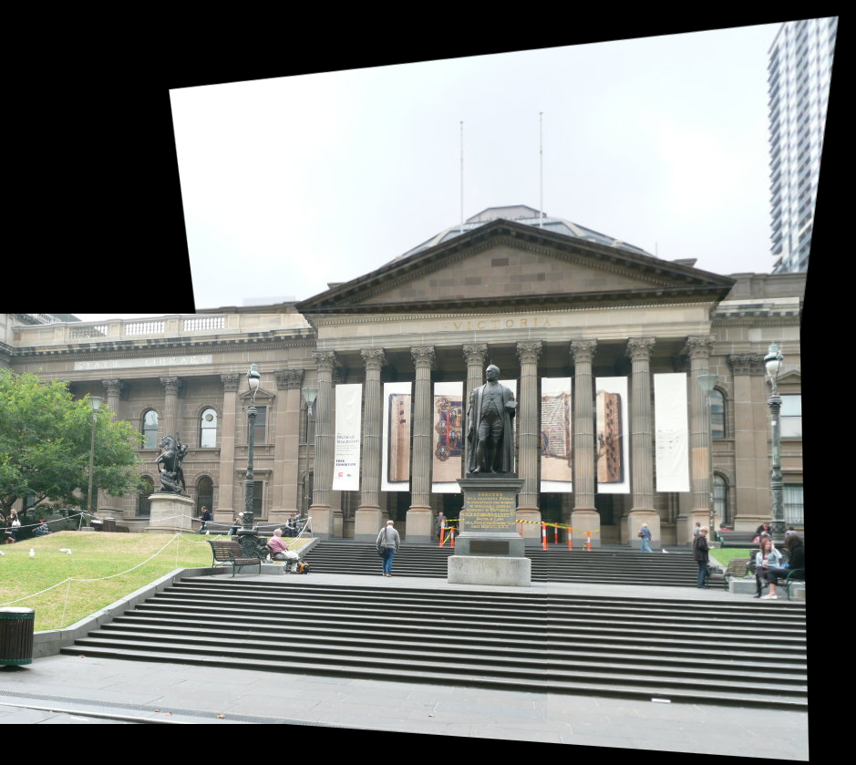
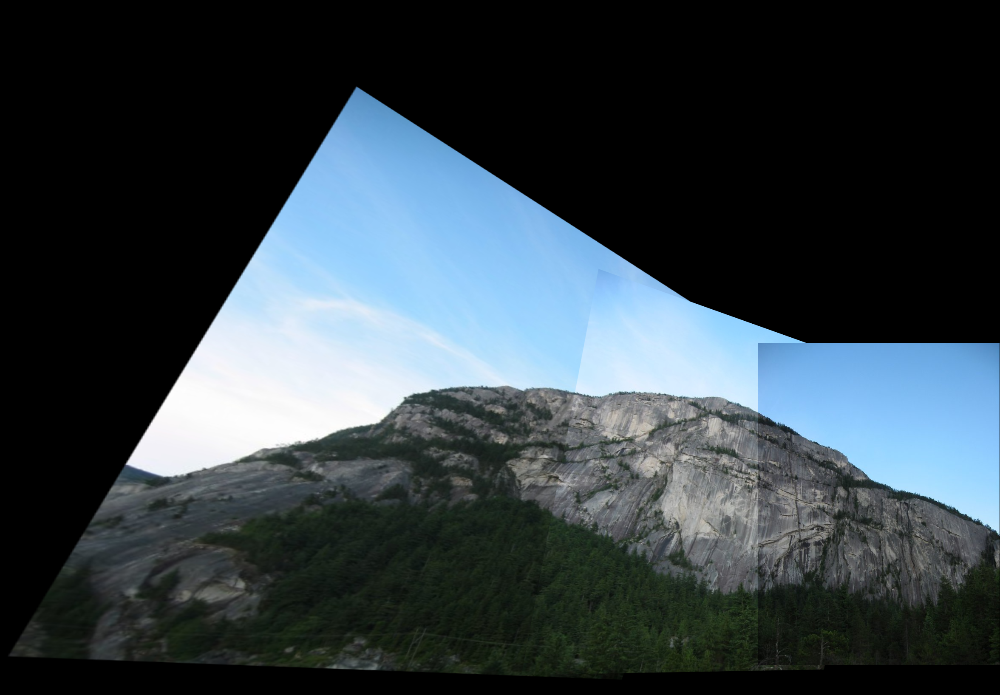
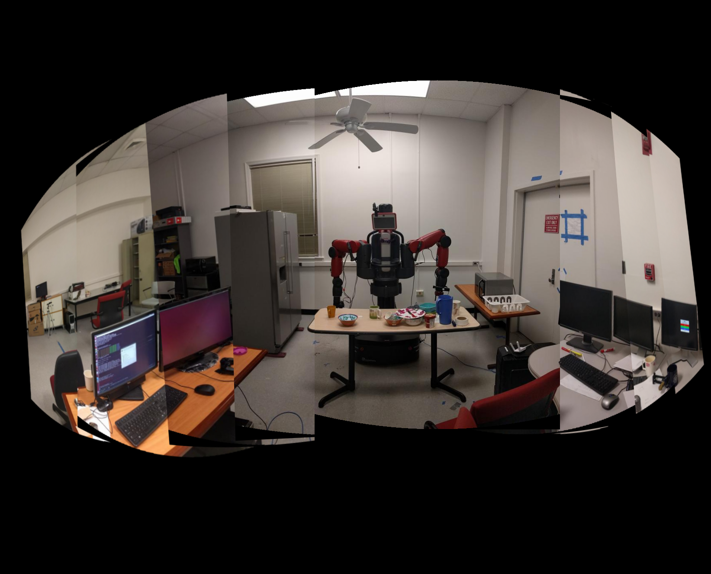

# AutoPano
The aim of this project is to stitch two or more images (with 30-50% overlap) together to create one seamless panorama image. In the first phase, we use the traditional feature descriptors method, and in the second phase, we take a deep learning approach for homography estimation. 

## Setting up the package
This package was built using Python 3.7, Pytorch and OpenCV on Ubuntu 20.04. Follow the instructions on [this](https://pytorch.org/get-started/locally/) page to setup Pytorch and [this](https://docs.opencv.org/3.4/d2/de6/tutorial_py_setup_in_ubuntu.html) page to setup OpenCV for Ubuntu. Other packages include `matplotlib`, `scipy` and `scikitlearn`. These are relatively easy to install using `pip install *package_name*`. 

Download the package:
```
git clone git@github.com:latent-pixel/AutoPano.git
```

## Phase I: Stitching Images via Feature Descriptor Method
The correspondences between two images are computed using feature descriptors, which are in turn computed by using Adaptive Non-Maximal Suppression (ANMS) on corners detected using traditional corner detection methods such as Harris Corners.

### Running the package

From the package's root directory, use the following command to run it:
```
python3 phase1/code/Wrapper.py
```
The results can then be found in a separate `results` folder in the package.

### Results

After Non-Maximal Suppression, 
Harris Corners            |  Shi-Tomasi Corners
:-------------------------:|:-------------------------:
  |  

Finally, the panoramas created:
<table style="width:100%">
  <tr>
  <th>Set 1</th>
  <th>Set 2</th>
  <th>Set 3</th>
  </tr>
  <tr>
    <td style="width: 33%"></td>
    <td style="width: 33%"></td>
    <td style="width: 34%"></td>
  </tr>
</table>
